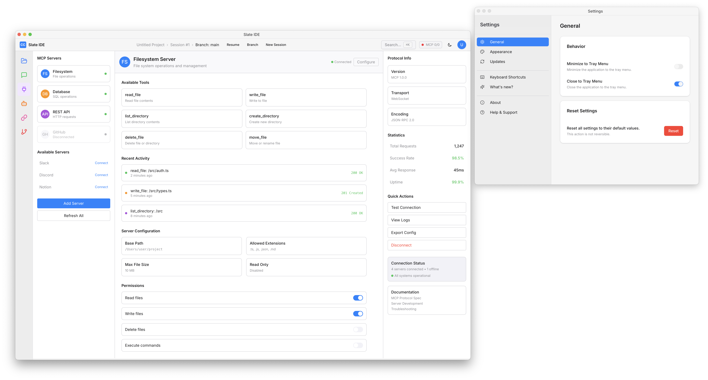

# ⚡️ Slate IDE

[](https://github.com/razorback16/slate-ide/pulse)
[](https://www.rust-lang.org)
[](https://tauri.app)

<!-- [](https://github.com/razorback16/slate-ide/actions/workflows/test.yml) -->

---

## 🚀 What is Slate IDE?

**Slate IDE** is a next-generation AI-powered desktop development environment that seamlessly integrates artificial intelligence into your coding workflow. Built with modern technologies like Tauri, React, and TypeScript, Slate IDE provides a comprehensive platform for AI-assisted development.

### 🎯 Key Features

- **🤖 AI Chat Integration**: Direct conversation with Claude AI for code assistance, debugging, and development guidance
- **📝 Smart Code Editor**: Monaco-based editor with syntax highlighting, IntelliSense, and AI-powered suggestions
- **🔌 MCP (Model Context Protocol) Support**: Connect to various external services and APIs through standardized protocols
- **📁 Intelligent Codebase Management**: AI-suggested file relationships and smart working sets
- **🎨 Modern UI/UX**: Beautiful, responsive interface with dark/light theme support
- **⚙️ Extensible Architecture**: Plugin system for custom integrations and workflows
- **🔄 Git Integration**: Built-in version control with AI-assisted commit messages and code reviews
- **🎯 Agent System**: Specialized AI agents for different development tasks

### 🏗️ Core Views

- **Chat View**: Interactive AI conversation with Claude, featuring action trails and context awareness
- **Codebase View**: File explorer, Monaco code editor, and intelligent code outline
- **MCP View**: Manage Model Context Protocol servers and their tools/permissions
- **Agents View**: Configure and interact with specialized AI development agents
- **Git View**: Version control operations with AI assistance
- **Hooks View**: Manage development lifecycle hooks and automation

## 🛠️ Prerequisites

Before running Slate IDE, ensure you have the following installed:

- **[Rust](https://www.rust-lang.org/tools/install)** (v1.77 or later)
- **[Node.js](https://nodejs.org/en/download)** (v18 or later)
- **[pnpm](https://pnpm.io/installation)** (v8 or later)
- **[Lefthook](https://github.com/evilmartians/lefthook)** (for git hooks)

### Installing pnpm

If you don't have pnpm installed, you can install it using:

```bash
# Using npm
npm install -g pnpm

# Using Homebrew (macOS)
brew install pnpm

# Using Cargo (if you have Rust installed)
cargo install pnpm
```

## 🚀 Quick Start

### 1. Clone the Repository

```bash
git clone https://github.com/razorback16/slate-ide.git
cd slate-ide
```

### 2. Install Dependencies

```bash
pnpm install
```

This will:
- Install all frontend dependencies
- Set up git hooks with Lefthook
- Configure the development environment

### 3. Start Development

```bash
pnpm dev
```

This command starts the Tauri development server with hot reload enabled. The application will open automatically.

### 4. Build for Production

```bash
# Standard build
pnpm build

# Debug build (with developer tools enabled)
pnpm build:debug
```

## 📋 Available Scripts

### Development
- `pnpm dev` - Start development server with hot reload
- `pnpm dev:ui` - Start only the frontend development server
- `pnpm typecheck` - Run TypeScript type checking

### Building
- `pnpm build` - Build for production
- `pnpm build:debug` - Build with debug mode enabled
- `pnpm build:ui` - Build only the frontend
- `pnpm build:mac:x64` - Build for macOS Intel
- `pnpm build:mac:arm` - Build for macOS Apple Silicon
- `pnpm build:mac:universal` - Build universal macOS binary
- `pnpm build:win:x64` - Build for Windows x64
- `pnpm build:win:arm` - Build for Windows ARM

### Code Quality
- `pnpm check` - Run Biome linter and formatter
- `pnpm lint` - Run linter with auto-fix
- `pnpm format` - Format all code (Rust + JavaScript)
- `pnpm format:rs` - Format Rust code only
- `pnpm format:js` - Format JavaScript/TypeScript code only

### Testing
- `pnpm test:js` - Run JavaScript/TypeScript tests
- `pnpm test:rs` - Run Rust tests
- `pnpm test:ui` - Run tests with UI
- `pnpm test:coverage` - Generate test coverage report

### Maintenance
- `pnpm cleanup` - Clean all build artifacts and dependencies
- `pnpm update-deps` - Check for dependency updates
- `pnpm generate:icons` - Generate app icons from source

## 🏗️ Project Structure

```
slate-ide/
├── src/                         # Frontend source code
│   ├── components/              # React components
│   │   ├── common/              # Shared components
│   │   ├── layout/              # Layout components
│   │   ├── settings/            # Settings panels
│   │   └── ui/                  # UI primitives
│   ├── views/                   # Main application views
│   │   ├── ChatView.tsx         # AI chat interface
│   │   ├── CodebaseView.tsx     # Code editor and file explorer
│   │   ├── MCPView.tsx          # MCP server management
│   │   ├── AgentsView.tsx       # AI agents configuration
│   │   └── GitView.tsx          # Git integration
│   ├── layouts/                 # Page layouts
│   ├── stores/                  # State management
│   ├── styles/                  # CSS and styling
│   └── libs/                    # Utility libraries
├── src-tauri/                   # Tauri backend (Rust)
│   ├── src/                     # Rust source code
│   ├── capabilities/            # Tauri capabilities
│   └── icons/                   # Application icons
├── assets/                      # Static assets
├── docs/                        # Documentation
└── tests/                       # Test files
```

## 🎨 Tech Stack

### Frontend
- **[React 18](https://reactjs.org)** - UI framework
- **[TypeScript](https://www.typescriptlang.org)** - Type safety
- **[Tailwind CSS](https://tailwindcss.com)** - Styling
- **[Radix UI](https://www.radix-ui.com)** - UI primitives
- **[Monaco Editor](https://microsoft.github.io/monaco-editor)** - Code editor
- **[Vite](https://vitejs.dev)** - Build tool

### Backend
- **[Tauri](https://tauri.app)** - Desktop app framework
- **[Rust](https://www.rust-lang.org)** - Systems programming language

### Development Tools
- **[Biome](https://biomejs.dev)** - Linting and formatting
- **[Vitest](https://vitest.dev)** - Testing framework
- **[Lefthook](https://github.com/evilmartians/lefthook)** - Git hooks

## 🔧 Development Setup

### IDE Recommendations

**Visual Studio Code** with the following extensions:
- Rust Analyzer
- Tauri
- TypeScript and JavaScript Language Features
- Tailwind CSS IntelliSense
- Biome

### Environment Configuration

1. Copy the environment template:
   ```bash
   cp .env.example .env
   ```

2. Configure your environment variables as needed.

### Git Hooks

Git hooks are automatically installed via Lefthook when you run `pnpm install`. They include:
- Pre-commit: Code formatting and linting
- Pre-push: Type checking and tests

## 🍎 macOS Setup

### Fix Unsigned Warning

If you see a warning about the app being "damaged" on macOS:

```bash
xattr -r -d com.apple.quarantine "/Applications/Slate IDE.app"
```

### Additional Dependencies

For optimal performance on macOS, install:

```bash
# GTK dependencies (if needed)
brew install gtk+3

# Additional development tools
brew install pkg-config
```

## 📸 Screenshots

<picture>
  <source media="(prefers-color-scheme: dark)" srcset="./assets/images/screenshot-dark.png">
  <source media="(prefers-color-scheme: light)" srcset="./assets/images/screenshot-light.png">
  
</picture>

*Slate IDE automatically adapts to your GitHub theme preference*

## 🤝 Contributing

We welcome contributions! Please see our [Contributing Guidelines](./CONTRIBUTING.md) for details.

1. Fork the repository
2. Create a feature branch: `git checkout -b feature/amazing-feature`
3. Make your changes and run tests: `pnpm test:js && pnpm test:rs`
4. Commit your changes: `git commit -m 'Add amazing feature'`
5. Push to the branch: `git push origin feature/amazing-feature`
6. Open a Pull Request

## 📄 License

Licensed under either of [Apache License 2.0][license-apache] or [MIT license][license-mit] at your option.

> Unless you explicitly state otherwise, any contribution intentionally submitted
> for inclusion in this project by you, as defined in the Apache-2.0 license, shall
> be dual licensed as above, without any additional terms or conditions.

Copyrights in this project are retained by their contributors.

See the [LICENSE-APACHE](./LICENSE-APACHE) and [LICENSE-MIT](./LICENSE-MIT) files for more information.

## 🙏 Acknowledgements

- [Tauri Examples Repo](https://github.com/tauri-apps/tauri/tree/dev/examples)
- [tauri-tray-icon-animation](https://github.com/rming/tauri-tray-icon-animation)
- [tauri-tray-menu](https://github.com/rming/tauri-tray-menu)
- [tauri-window-controls](https://github.com/agmmnn/tauri-controls)
- [tauri-plugin-theme](https://github.com/wyhaya/tauri-plugin-theme)
- [hamza72x/web2app](https://github.com/hamza72x/web2app)
- [Create a Menu Bar App With Tauri](https://betterprogramming.pub/create-menubar-app-with-tauri-510ab7f7c43d)
- [Publishing Tauri to Apple's App Store](https://thinkgo.io/post/2023/02/publish_tauri_to_apples_app_store)
- [GTK Installation Docs](https://www.gtk.org/docs/installations/macos)
- [Tips For Faster Rust Compile Times](https://corrode.dev/blog/tips-for-faster-rust-compile-times)
- [Tauri State Management](https://tauri.by.simon.hyll.nu/concepts/tauri/state_management)

[rust]: https://www.rust-lang.org/tools/install
[react]: https://reactjs.org
[biome]: https://biomejs.dev
[nodejs]: https://nodejs.org/en/download
[pnpm]: https://pnpm.io/installation
[tailwindcss]: https://tailwindcss.com
[persy]: https://crates.io/crates/persy
[lefthook]: https://github.com/evilmartians/lefthook
[riipandi-twitter]: https://twitter.com/intent/follow?screen_name=riipandi
[license-mit]: https://choosealicense.com/licenses/mit/
[license-apache]: https://choosealicense.com/licenses/apache-2.0/

---

<sub>🤫 Psst! If you like my work you can support me via [GitHub sponsors](https://github.com/sponsors/riipandi).</sub>

[][riipandi-twitter]
